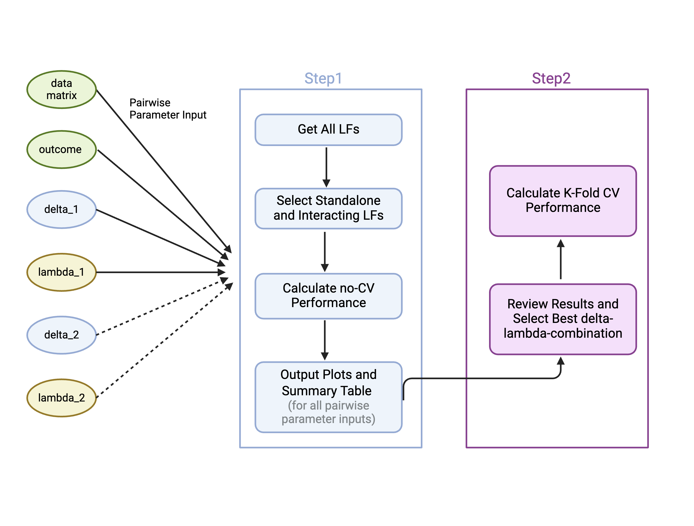
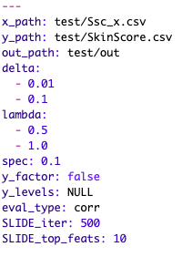

**SLIDE Pipeline**

The SLIDE pipeline is consisted of below two steps. We recommand to run both steps on a computational cluster for optimal computational time.

1.  Calculating and select latent factors (LFs) for multiple input parameter combinations.

2.  Reviewing the output of step 1 and choose the optimal parameters for rigorous k-fold CV.

    

**Step 1: Parameter Tuning**

**1-1 Pre-Processing and Checking Input Data**

Due to the assumption-free-nature of SLIDE, there are no data modality limit to the input of SLIDE.

[The key input to SLIDE are just two csv files, the data matrix x and the response vector y file post pre-processing such as batch effect correction and/or normalization (for example, for scRN-seq data, first process with the standard Seurat pipeline).]{.underline}

The x file contains your data in a sample by feature format, such as single cell transcriptomics (**cell by gene**), or spatial proteomics (**region by protein**). The y file contains the responses of the data, such as severity of disease, spatial regions or clonal expansion. Since SLIDE is a regression method, when the response vector has multiple unique values (not just two classes), please make sure there are an ordinal relation between the y values. **Please make sure both csv files have row names and column names.**

In this tutorial, we are going to use the example Systemic Sclerosis dataset we have used in the SLIDE paper. This dataset is a human skin cell scRNA-seq dataset that we have transformed into the pseudo-bulk format.

[If you have human single-cell data,]{.underline} our recommended workflow is to pseudobulk your dataset since the cell-to-cell variability is high. [If you have mouse single cell data]{.underline}, with the reduced cell-to-cell variability, you can consider each cell as an sample. For single-cell datasets, the sparsity might be extremely high with high feature numbers. In this case, please see below for how to reduce the number of features and samples with large amount of zeros.

**1-2 Parameters**

The input to SLIDE is the path to a YAML file which documents the parameters.



SLIDE accepts many parameters from user input to give user as much freedom to tweak the method to their own data as possible. We have set default values to many parameters that works well with majority of the data moralities. Here, we explain what each of these parameters mean.

**x_path:** a string of the path to the data matrix (x) in the csv format [with row names and column names where each row is samples (cells, patients, regions...) and each column is a features (genes, proteins...)]{.underline}.

**y_path:** a string of the path of the response vector (y) in the csv format [with row names and column names where each row is a sample and the column would be the outcome of interest.]{.underline}

**out_path:** a string of the path of a folder to store all output files (please see below section to interpret the outputs).

**delta:** control the number of all latent factors. The higher the delta, the less number of latent factors will be found. Default as 0.01 and 0.1.

**lambda:** control the sparsity of all latent factors. The higher the lambda, the less number of features will be in a latent factor. Default as 0.5 and 1.

**spec:** control the number of significant latent factors. The higher the spec, the less number of significant latent factors will be outputted. [The desired number of output shoul be between 5 to 12 LFs]{.underline}. Default as 0.1.

**y_factor:** set to false if not binary and true if binary.

**y_levels:** null if y is continuous or ordinal. If y is binary, input a list of the correct order relationship such as [0, 1] or [1, 2].

**eval_type:** the performance evaluation metric used. corr for continuous Y and auc for binary Y.

**SLIDE_iter:** the number of times to repeat the SLIDE latent factor selection algorithm. The higher the iteration, the more stable the performance would be. Default as

**SLIDE_top_feats:** the number of top features to plot from each latent factor. If set as n, a union of the top n weighted features and top n correlated (with y) features will be outputted.

**do_interacts (optional):** set to false if don't want interacting latent factors. Default as TRUE

thresh_fdr: set to lower if co-linearity of the features in the data matrix is high. Default as 0.2.

**2-1 Check YAML file**

Once your YAML file is ready, we first recommend using a YAML validator website to ensure your YAML file is correctly formatted.

We can then check what the YAML file looks like by reading it in as an variable.

```{r}
library(SLIDE)
yaml_path = "/ix/djishnu/Hanxi/SLIDE/test/test.yaml"
input_params = yaml::read_yaml(yaml_path)
```

If you have a sparse dataset such as scRNA-seq datasets, we recommend filtering out samples and features that have too many zeros.

```{r}zeroFiltering(yaml_path, g_thresh, c_thresh)}

```

```{r}
checkDataParams(yaml_path)
```

The x_path and y_path are the path to the input data matrices and response vector in the csv format. Both row names and column names are needed. The out_path is where all the output will automatically be populated to.

Delta and Lambda are 2 key parameters for SLIDE. Delta tunes the number of latent factors, the higher the delta, the less number of latent factors will be produced. Lambda tunes the sparsity in each latent factors such as how many members each latent factors will contain. The higher the lambda, the more sparse the latent factors will be. SLIDE will automatically run the method pairwise of delta and lambda. For example, with the example YAML file, four SLIDE output will be produced with delta = 0.01 - lambda = 0.5, delta = 0.01 - lambda = 0.5...

Spec is the parameter that controls the number of significant latent factor chosen by the algorithm. The lower the spec is the

```{r setup}

```

```{r setup}
```
